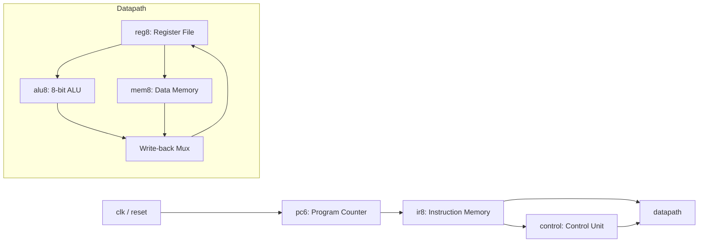

# 8-bit CPU

This project implements and simulates a simple 8-bit CPU in Verilog. The design includes a Program Counter, Instruction Memory, Control Unit, Datapath, Register File, Data Memory, and an 8-bit ALU. The sample program stored in this repository loads eight values from data memory, accumulates them with ALU additions, halts, and writes the final register and memory states to output files for verification.

Repository: [https://github.com/cta1511/8-bit-CPU](https://github.com/cta1511/8-bit-CPU)

## Project Goals

The main goal is to build a small RTL-level processor model with enough structure to demonstrate the basic CPU execution flow:

- Use a 6-bit Program Counter to address up to 64 instructions.
- Store 32-bit instructions in an Instruction Memory.
- Decode instruction opcodes with a Control Unit.
- Execute operations through a Datapath and an 8-bit ALU.
- Provide a 32-register file, where each register is 8 bits wide.
- Provide a 256-byte Data Memory, where each memory entry is 8 bits wide.
- Support immediate load, register/memory transfer, ALU operations, load/store, and halt.
- Generate simulation artifacts such as `reg_out.o`, `data_out.o`, and waveform files.

## Architecture Overview

The CPU follows the basic fetch -> decode -> execute -> memory/write-back flow.



Signal-level summary:

| Connection | Signal or field | Purpose |
| --- | --- | --- |
| `pc6` -> `ir8` | `q[5:0]` | Selects one of 64 instruction-memory locations. |
| `ir8` -> `control` | `instr[31:26]` | Provides the opcode for decoding. |
| `ir8` -> `datapath` | `instr[31:0]` | Provides the full instruction fields. |
| `control` -> `datapath` | `op`, `mread`, `mwrite`, `alusrc`, `rdt`, `mtr`, `rwrite`, `regprint` | Controls the datapath, memory access, register write-back, and debug dump. |

Top-level execution flow in `main8.v`:

1. `pc6` receives `clk` and `reset`, then outputs the current instruction address `q[5:0]`.
2. `ir8` reads a 32-bit instruction from `test.prog`.
3. `control` decodes `opcode = instr[31:26]` and generates control signals.
4. `datapath` splits the instruction fields, reads registers, runs the ALU or Data Memory path, and writes results back to the Register File.
5. When `hlt` is reached, `regprint` is asserted and the design writes the final Register File and Data Memory states to `reg_out.o` and `data_out.o`.

## Repository Structure

```text
.
|-- main8.v                         # Top-level CPU module
|-- main8_tb.v                      # Full CPU testbench
|-- datapath.v                      # Register, ALU, memory, and write-back datapath
|-- control.v                       # Control Unit opcode decoder
|-- control_tb.v                    # Control Unit testbench
|-- scheme.txt                      # Original control table, instruction set, and sample program notes
|-- Report.pptx                     # Project report
|-- ProgramCounter/
|   |-- pc6.v                       # 6-bit Program Counter
|   |-- tff1.v                      # T flip-flop used by the counter
|   |-- pc6_tb.v                    # Program Counter testbench
|   `-- mota_pc.txt                 # Program Counter notes
|-- InstructionRegister/
|   |-- ir8.v                       # 64 x 32-bit Instruction Memory
|   |-- ir8_tb.v                    # Instruction Memory testbench
|   |-- test.prog                   # Sample program with 64 instruction slots
|   `-- mota_rom_ir8.txt            # Instruction Memory notes
|-- DataMemory/
|   |-- mem8.v                      # 256 x 8-bit Data Memory
|   |-- mem8_tb.v                   # Data Memory testbench
|   |-- test.data                   # Data Memory initialization data
|   `-- mota_ocung_mem8.txt         # Data Memory notes
|-- GPIOs/
|   |-- reg8.v                      # 32 x 8-bit Register File
|   |-- reg8_tb.v                   # Register File testbench
|   `-- mota_ram_reg8.txt           # Register File notes
`-- ALU/
    |-- alu8.v                      # Main ALU module
    |-- alu8_tb.v                   # ALU testbench
    |-- mota.txt                    # ALU overview notes
    |-- 8 bit recursive dabling adder/
    |   `-- rd8.v                   # 8-bit recursive doubling adder
    |-- 8 bit wallace tree multiplication/
    |   `-- wtm8.v                  # 8-bit Wallace tree multiplier
    |-- 8 bit non restoring division/
    |   `-- nrd8.v                  # 8-bit non-restoring divider
    `-- 8 bit barrel shifter/
        `-- bs8.v                   # 8-bit barrel shifter
```

## Main Modules

### `main8.v`

`main8` is the top-level CPU module.

Ports:

| Name | Direction | Width | Description |
| --- | --- | --- | --- |
| `clk` | input | 1 bit | CPU simulation clock. |
| `reset` | input | 1 bit | Active-high Program Counter reset. |

Internal blocks:

- `pc6 ppp(clk, reset, q)`: generates the instruction address.
- `ir8 iii(q, instr)`: reads a 32-bit instruction from instruction memory.
- `datapath daa(...)`: executes the instruction.
- `control con(...)`: decodes the opcode and drives the datapath control signals.

### `pc6.v`

`pc6` is a 6-bit Program Counter.

- It counts from `0` to `63`.
- It is built from six cascaded T flip-flops.
- `reset = 1` clears the counter output to `0`.
- The 6-bit width matches the 64-entry Instruction Memory.

### `ir8.v`

`ir8` is the Instruction Memory.

- Capacity: 64 words.
- Word width: 32 bits.
- Read address: `out_address[5:0]`.
- Read data: `out_data[31:0]`.
- It loads instructions from `test.prog` using `$readmemb`.

During full CPU simulation, `test.prog` must be available in the current working directory used by `vvp`. The run instructions below copy it into `build/` for that reason.

### `control.v`

`control` receives `opcode[5:0]` and generates the signals that drive the datapath.

Outputs:

| Signal | Description |
| --- | --- |
| `op[1:0]` | Operation group selector. `01` enables ALU execution; `10` is used by the current immediate/load/store path. |
| `mread` | Enables Data Memory reads. |
| `mwrite` | Enables Data Memory writes. |
| `alusrc` | Selects an immediate value for write-back instead of the ALU result. |
| `rdt` | Selects the register-field format used by ALU instructions. |
| `mtr` | Memory-to-register selector; writes memory output back to a register. |
| `rwrite` | Enables Register File writes. |
| `regprint` | Enables final Register File and Data Memory dumps on `hlt`. |

### `datapath.v`

`datapath` splits each 32-bit instruction into fields and executes it using the Register File, ALU, and Data Memory.

Instruction fields used by the current RTL:

| Field | Bits | Meaning in the code |
| --- | --- | --- |
| `opcode` | `[31:26]` | Opcode sent to the Control Unit and used for ALU operation selection. |
| `rwdt1` | `[25:21]` | Main destination register address. |
| `rwdt2` | `[20:16]` | Secondary destination register address when `rdt = 1`. |
| `rsc2` | `[9:5]` | ALU source register A when `rdt = 1`. |
| `rsc1` | `[4:0]` | ALU source register B, or store source register. |
| `imm` | `[7:0]` | 8-bit immediate value used by `mvi`. |
| `ddt` | `[7:0]` or `[25:18]` | Data Memory address. Load uses `[7:0]`; store uses `[25:18]`. |

Main datapath behavior:

1. The Register File reads `out_data1` and `out_data2`.
2. The ALU receives `a = out_data2` and `b = out_data1`.
3. Data Memory receives address `ddt`.
4. Write-back selects either memory data or the ALU/immediate path.
5. The Register File writes `in_data1` to `rwdt1` and `in_data2` to `rwdt2`.

### `reg8.v`

`reg8` is the Register File.

- 32 registers.
- Each register is 8 bits wide.
- Two read ports: `address1`, `address2`.
- Two write ports: `rwdt1`, `rwdt2`.
- Writes occur on `posedge clk` when `w_en = 1`.
- Reads are asynchronous through continuous assignments.
- When `p_en = 1`, the module writes all 32 register values to `reg_out.o`.

### `mem8.v`

`mem8` is the Data Memory.

- 256 memory locations.
- Each memory location is 8 bits wide.
- Initial contents are loaded from `test.data`.
- Writes occur on `posedge clk` when `w_en = 1`.
- Reads are asynchronous when `en = 1`.
- When `p_en = 1`, the module writes all 256 memory values to `data_out.o`.

### `alu8.v`

`alu8` is the 8-bit Arithmetic Logic Unit.

Ports:

| Signal | Width | Description |
| --- | --- | --- |
| `a` | 8 bits | Operand A. |
| `b` | 8 bits | Operand B. |
| `opc` | 4 bits | ALU operation code, taken from the low 4 bits of the instruction opcode. |
| `op` | 2 bits | Operation group selector. ALU operations run when `op = 2'b01`. |
| `out` | 8 bits | Main result. |
| `out2` | 8 bits | Secondary result, used by multiply and divide. |
| `carry` | 1 bit | Carry-out or comparison flag. |

ALU submodules and functions:

- `rd8`: 8-bit recursive doubling adder, used for addition and subtraction.
- `wtm8`: 8-bit Wallace tree multiplier.
- `nrd8`: 8-bit non-restoring divider.
- `bs8`: 8-bit barrel shifter.
- Logic operations: not, and, or, nand, nor, xor, xnor.
- Comparison operations: greater-than and equality.

## Instruction Format

Each instruction is 32 bits wide. The upper 6 bits are always the opcode.

### ALU instruction format

```text
31          26 25     21 20     16 15          10 9       5 4       0
+-------------+---------+---------+--------------+---------+---------+
| opcode[5:0] | dest1   | dest2   | reserved     | srcA    | srcB    |
+-------------+---------+---------+--------------+---------+---------+
```

Field meanings:

- `dest1`: register that receives `out`.
- `dest2`: register that receives `out2`; useful for `mul` and `div`.
- `srcA`: register used as ALU operand A.
- `srcB`: register used as ALU operand B.
- For single-result operations such as add, sub, logic, and shift operations, `dest2` can usually be set to `0`.

Example:

```text
0100_0000_0010_0000_0000_0000_0010_0010
```

This encodes `add r1, r1, r2`:

- `opcode = 010000`: add.
- `dest1 = 00001`: write the main result to `reg[1]`.
- `srcA = 00001`: read `reg[1]`.
- `srcB = 00010`: read `reg[2]`.

### `mvi` format

```text
31          26 25     21 20                         8 7       0
+-------------+---------+----------------------------+---------+
| 100000      | dest    | unused                     | imm8    |
+-------------+---------+----------------------------+---------+
```

Behavior: `dest = imm8`.

### `load` format

```text
31          26 25     21 20                         8 7       0
+-------------+---------+----------------------------+---------+
| 100010      | dest    | unused                     | addr8   |
+-------------+---------+----------------------------+---------+
```

Behavior: `dest = data_mem[addr8]`.

### `store` format

```text
31          26 25       18 17                    5 4       0
+-------------+-----------+-----------------------+---------+
| 100011      | addr8     | unused                | src     |
+-------------+-----------+-----------------------+---------+
```

Behavior: `data_mem[addr8] = reg[src]`.

### `hlt` format

```text
31          26 25                                      0
+-------------+-----------------------------------------+
| 111111      | unused                                  |
+-------------+-----------------------------------------+
```

Behavior: asserts `regprint` so the simulation writes the Register File and Data Memory states to output files.

## Instruction Set

### Non-ALU instructions

| Opcode | Mnemonic | Description | Notes |
| --- | --- | --- | --- |
| `100000` | `mvi dest, imm8` | Writes an 8-bit immediate value to a register. | Uses `alusrc = 1`. |
| `100001` | `mov dest, src` | Intended register-to-register move. | Opcode exists in `control.v`; see the technical note at the end of this README. |
| `100010` | `load dest, [addr]` | Reads Data Memory into a register. | Uses `mread = 1` and `mtr = 1`. |
| `100011` | `store [addr], src` | Writes a register value to Data Memory. | Uses `mwrite = 1`. |
| `111111` | `hlt` | Ends the sample program and writes debug output files. | Asserts `regprint = 1`. |

### ALU instructions

ALU opcodes use the form `01xxxx`. The low four bits `xxxx` are passed to the ALU as `opc`.

| Opcode | `opc` | Mnemonic | Result |
| --- | --- | --- | --- |
| `010000` | `0000` | `add dest, a, b` | `out = a + b`, `carry = carry_out` |
| `010001` | `0001` | `sub dest, a, b` | `out = a - b`, `carry = carry_out` |
| `010010` | `0010` | `mul destLow, destHigh, a, b` | `out = product[7:0]`, `out2 = product[15:8]` |
| `010011` | `0011` | `div quotient, remainder, a, b` | `out = quotient`, `out2 = remainder` |
| `010100` | `0100` | `shl dest, a, b` | `out = a << b[2:0]` |
| `010101` | `0101` | `shr dest, a, b` | `out = a >> b[2:0]` |
| `010110` | `0110` | `rol dest, a` | `out = {a[6:0], a[7]}` |
| `010111` | `0111` | `not dest, a` | `out = ~a` |
| `011000` | `1000` | `and dest, a, b` | `out = a & b` |
| `011001` | `1001` | `or dest, a, b` | `out = a | b` |
| `011010` | `1010` | `nand dest, a, b` | `out = ~(a & b)` |
| `011011` | `1011` | `nor dest, a, b` | `out = ~(a | b)` |
| `011100` | `1100` | `xor dest, a, b` | `out = a ^ b` |
| `011101` | `1101` | `xnor dest, a, b` | `out = ~(a ^ b)` |
| `011110` | `1110` | `greater a, b` | `carry = 1` if `a > b`, otherwise `0` |
| `011111` | `1111` | `equal a, b` | `carry = 1` if `a == b`, otherwise `0` |

## Control Signal Table

The table below summarizes the values generated in `control.v`.

| Instruction | Opcode | `rdt` | `alusrc` | `mtr` | `rwrite` | `mread` | `mwrite` | `op` | `regprint` |
| --- | --- | --- | --- | --- | --- | --- | --- | --- | --- |
| `mvi` | `100000` | `0` | `1` | `0` | `1` | `0` | `0` | `10` | `0` |
| `mov` | `100001` | `0` | `0` | `0` | `1` | `0` | `0` | `10` | `0` |
| `load` | `100010` | `0` | `0` | `1` | `1` | `1` | `0` | `10` | `0` |
| `store` | `100011` | `0` | `0` | `0` | `0` | `0` | `1` | `10` | `0` |
| ALU | `01xxxx` | `1` | `0` | `0` | `1` | `0` | `0` | `01` | `0` |
| `hlt` | `111111` | `1` | `0` | `0` | `1` | `0` | `0` | `01` | `1` |

## Sample Program in `test.prog`

The sample program adds eight values from Data Memory:

```text
load r1, [61]
load r2, [62]
add  r1, r1, r2
load r2, [63]
add  r1, r1, r2
load r2, [64]
add  r1, r1, r2
load r2, [65]
add  r1, r1, r2
load r2, [66]
add  r1, r1, r2
load r2, [67]
add  r1, r1, r2
load r2, [68]
add  r1, r1, r2
hlt
```

Data stored in `DataMemory/test.data` at addresses 61 through 68:

| Address | Binary | Decimal |
| --- | --- | --- |
| `61` | `00000101` | `5` |
| `62` | `00000101` | `5` |
| `63` | `00000101` | `5` |
| `64` | `00000101` | `5` |
| `65` | `00000101` | `5` |
| `66` | `00000101` | `5` |
| `67` | `00000101` | `5` |
| `68` | `00000111` | `7` |

Expected arithmetic result:

```text
5 + 5 + 5 + 5 + 5 + 5 + 5 + 7 = 42
```

After simulation, `reg_out.o` should include:

```text
reg_mem[1] = 00101010
```

`00101010` is decimal `42`.

## Tooling

The project was tested with Icarus Verilog.

Install on macOS:

```sh
brew install icarus-verilog
```

Check the installed tools:

```sh
iverilog -V
vvp -V
```

## Run the Full CPU Simulation

The design calls `$readmemb("test.prog")` and `$readmemb("test.data")`. Those files must be present in the working directory used by `vvp`. The commands below build and run the simulation from `build/`.

```sh
mkdir -p build

cp InstructionRegister/test.prog build/test.prog
cp DataMemory/test.data build/test.data

iverilog -o build/main8_sim \
  -IProgramCounter \
  -IInstructionRegister \
  -IDataMemory \
  -IGPIOs \
  -IALU \
  -I"ALU/8 bit recursive dabling adder" \
  -I"ALU/8 bit wallace tree multiplication" \
  -I"ALU/8 bit non restoring division" \
  -I"ALU/8 bit barrel shifter" \
  main8_tb.v

cd build
vvp main8_sim
```

Generated files in `build/`:

| File | Meaning |
| --- | --- |
| `main8_sim` | Simulator output generated by `iverilog`. |
| `main.vcd` | Waveform file for GTKWave or another waveform viewer. |
| `reg_out.o` | Register File state when `hlt` is executed. |
| `data_out.o` | Data Memory state when `hlt` is executed. |

Check the final register result:

```sh
sed -n '1,40p' reg_out.o
```

Important expected line:

```text
reg_mem[1] = 00101010
```

## Run Individual Testbenches

### Program Counter

```sh
cd ProgramCounter
iverilog -o pc6_sim pc6_tb.v
vvp pc6_sim
```

### Instruction Memory

```sh
cd InstructionRegister
iverilog -o ir8_sim ir8_tb.v
vvp ir8_sim
```

### Data Memory

```sh
cd DataMemory
iverilog -o mem8_sim mem8_tb.v
vvp mem8_sim
```

### Register File

```sh
cd GPIOs
iverilog -o reg8_sim reg8_tb.v
vvp reg8_sim
```

### Control Unit

```sh
iverilog -o build/control_sim control_tb.v
vvp build/control_sim
```

### ALU

```sh
iverilog -o build/alu8_sim \
  -IALU \
  -I"ALU/8 bit recursive dabling adder" \
  -I"ALU/8 bit wallace tree multiplication" \
  -I"ALU/8 bit non restoring division" \
  -I"ALU/8 bit barrel shifter" \
  ALU/alu8_tb.v

vvp build/alu8_sim
```

## Compile Notes

When compiling with `-Wall`, Icarus Verilog may report warnings while the sample simulation still runs:

- `implicit definition of wire 'f'`, `c`, or `c1`: some internal ALU helper wires are not declared explicitly.
- `@* is sensitive to all 256 words in array 'data_mem'`: this comes from the debug dump logic in `mem8.v`.

These warnings do not block the sample program simulation. For further development, it would be better to declare helper wires explicitly and move `$readmemb` or debug dump logic into clearer simulation-only blocks.

## Input and Output Files

### `InstructionRegister/test.prog`

- Contains up to 64 instructions.
- Each line is one 32-bit binary instruction.
- Underscores are used only for readability.
- The first line is loaded into `ir_mem[0]`.

### `DataMemory/test.data`

- Contains 256 data lines.
- Each line is one 8-bit binary value.
- The first line is loaded into `data_mem[0]`.

### `reg_out.o`

- Generated when `regprint = 1`.
- Dumps `reg_mem[0]` through `reg_mem[31]`.
- Used to verify the final CPU result.

### `data_out.o`

- Generated when `regprint = 1`.
- Dumps `data_mem[0]` through `data_mem[255]`.
- Used to inspect load/store behavior and final RAM state.

### `main.vcd` or `dump.vcd`

- Waveform output file.
- Can be opened with GTKWave:

```sh
gtkwave build/main.vcd
```

## Technical Notes

- The current CPU is a simple RTL simulation model, not a complete pipelined processor core.
- The Program Counter is 6 bits wide, so the program space is 64 instructions.
- Data Memory uses 8-bit addresses, so it has 256 addressable entries.
- Register File addresses are 5 bits wide, so it has 32 registers.
- For `mul`, the 16-bit product is split into `out` for the low 8 bits and `out2` for the high 8 bits.
- For `div`, `out` is the quotient and `out2` is the remainder.
- The `mov` opcode exists in `control.v`, but the current datapath does not include a direct write-back path from the source register to the destination register. To use `mov dest, src` as a real instruction, add a write-back path from `out_data1` or adjust the ALU/datapath behavior.

## Project Result

The project implements the core blocks of a small 8-bit CPU:

- Instruction fetch through Program Counter and Instruction Memory.
- Opcode decode through the Control Unit.
- Execution through an 8-bit ALU with add, subtract, multiply, divide, shift, rotate, logic, and comparison operations.
- Data Memory access through load/store instructions.
- Register File write-back.
- A sample program that sums eight values from RAM and produces the verified result `42`.
